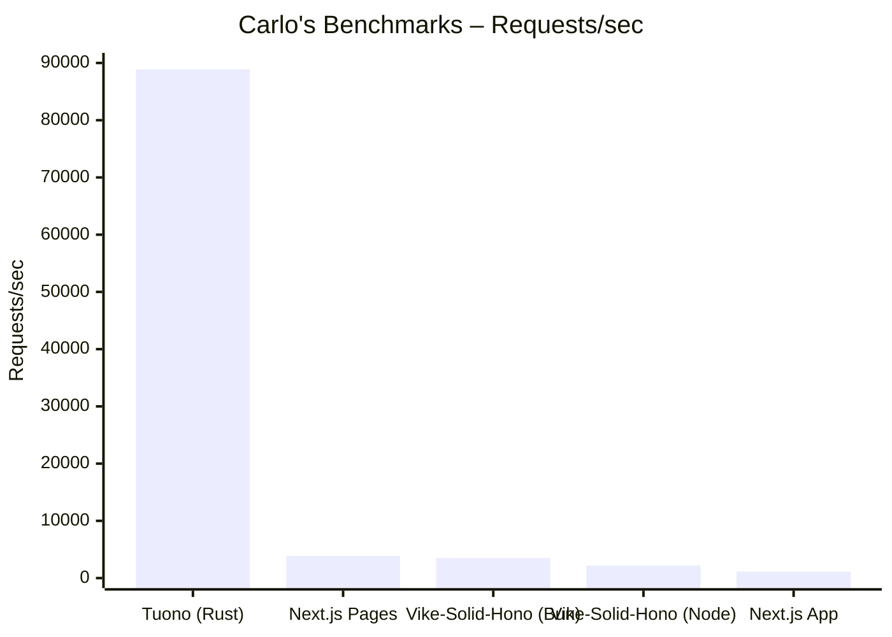
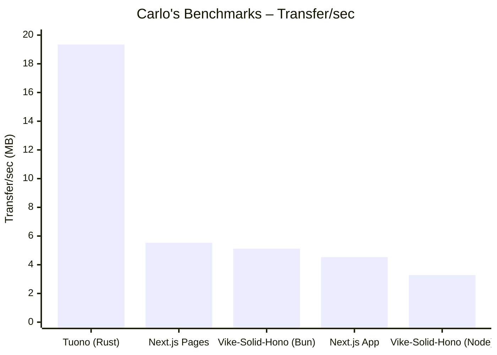

# Tuono benchmarks

This repository contains various setups to compare the HTTP performance of Tuono with other frameworks. Please refer to the [`benchmarks`](./benchmarks/) directory for more details.

The main goal is to make the comparison as fair as possible enhancing each framework specific
performance improvements.

Any improvement to the benchmarks or implementation of a different framework is strongly appreciated.

Feel free also to try it with your hardware and open an issue in case you spot significant different results.

## Benchmark setup

In order to make each comparison as fair as possible each framework should contain a single server side
rendered page that requires data from the backend service.

The data returned by the backend service should be a JSON including a random number between 0 and 10.

```json
{
  "data": 0
}
```

The benchmark is triggered by running the production server and querying the `/` endpoint with [wrk](https://github.com/wg/wrk) to simulate a heavy network load on the application.

## Last benchmarked version results

[v0.17.0](/benchmarks/v0.17.0)

### Tuono

```sh
tuono build
cargo run --release
```

```sh
wrk -t12 -c400 -d30s http://localhost:3000/
```

```text
Running 30s test @ http://localhost:3000/
  12 threads and 400 connections
  Thread Stats   Avg      Stdev     Max   +/- Stdev
    Latency    10.10ms    8.60ms 328.41ms   92.91%
    Req/Sec     3.47k   369.32     4.35k    92.02%
  1241083 requests in 30.02s, 700.90MB read
Requests/sec:  41341.09
Transfer/sec:     23.35MB
```

### NextJs pages router

```sh
pnpm build
pm2 start ./ecosystem.config.js
```

```sh
wrk -t12 -c400 -d30s http://localhost:3000/
```

```text
Running 30s test @ http://localhost:3000/
  12 threads and 400 connections
  Thread Stats   Avg      Stdev     Max   +/- Stdev
    Latency    40.86ms   36.33ms 964.36ms   97.35%
    Req/Sec     0.88k   141.64     2.36k    82.48%
  311635 requests in 30.08s, 445.20MB read
Requests/sec:  10358.80
Transfer/sec:     14.80MB
```

### NextJs app router

```sh
pnpm build
pm2 start ./ecosystem.config.js
```

```sh
wrk -t12 -c400 -d30s http://localhost:3000/
```

```text
Running 30s test @ http://localhost:3000/
  12 threads and 400 connections
  Thread Stats   Avg      Stdev     Max   +/- Stdev
    Latency    39.96ms   22.27ms 676.87ms   92.92%
    Req/Sec     0.86k   156.94     1.44k    80.99%
  306113 requests in 30.10s, 437.31MB read
Requests/sec:  10170.10
Transfer/sec:     14.53MB
```

---

CARLO's BENCHMARKS on Apple M3 Max 36 GB

### Vike Solid Hono

```sh
pnpm build
pnpm start
```

```sh
# VIKE-SOLID-HONO (Bun)
Running 30s test @ http://localhost:3000/
  12 threads and 400 connections
  Thread Stats   Avg      Stdev     Max   +/- Stdev
    Latency   111.99ms    7.80ms 263.38ms   89.05%
    Req/Sec   295.17     25.40   340.00     75.41%
  105946 requests in 30.11s, 154.08MB read
Requests/sec:   3519.08
Transfer/sec:      5.12MB

# VIKE-SOLID-HONO (Node)
Running 30s test @ http://localhost:3000/
  12 threads and 400 connections
  Thread Stats   Avg      Stdev     Max   +/- Stdev
    Latency   112.74ms   62.36ms   1.98s    91.34%
    Req/Sec   186.64     65.17   485.00     74.18%
  65840 requests in 30.09s, 98.71MB read
  Socket errors: connect 0, read 131, write 0, timeout 273
Requests/sec:   2188.33
Transfer/sec:      3.28MB

# NEXTJS PAGES
Running 30s test @ http://localhost:3000/
  12 threads and 400 connections
^[  Thread Stats   Avg      Stdev     Max   +/- Stdev
    Latency    82.53ms   68.13ms   1.98s    98.73%
    Req/Sec   329.79     75.07     0.92k    86.38%
  116562 requests in 30.10s, 166.54MB read
  Socket errors: connect 0, read 61, write 0, timeout 282
Requests/sec:   3872.30
Transfer/sec:      5.53MB

# NEXT APP
❯ wrk -t12 -c400 -d30s http://localhost:3000/
Running 30s test @ http://localhost:3000/
  12 threads and 400 connections
  Thread Stats   Avg      Stdev     Max   +/- Stdev
    Latency   260.49ms  101.36ms   1.99s    81.26%
    Req/Sec    96.40     34.51   260.00     69.72%
  34075 requests in 30.10s, 136.25MB read
  Socket errors: connect 0, read 70, write 0, timeout 291
Requests/sec:   1132.00
Transfer/sec:      4.53MB

# TUONO
Running 30s test @ http://localhost:3000/
  12 threads and 400 connections
  Thread Stats   Avg      Stdev     Max   +/- Stdev
    Latency     4.47ms    1.40ms 131.41ms   95.52%
    Req/Sec     7.47k     1.02k   46.50k    98.00%
  2676085 requests in 30.10s, 582.11MB read
Requests/sec:  88902.85
Transfer/sec:     19.34MB
```

These charts were coded by Kimi K2 Instruct 0905 (Prompt: "Make a bar chart of Carlo's Benchmarks for Requests and Transfers per sec in mermaid's xychart-beta. Sort from highest to lowest. Also put bulletpoints under each chart of what is the highest to lowest.")



- **Highest:** Tuono (Rust) – 88,903 req/sec
- **Next:** Next.js Pages – 3,872 req/sec
- **Then:** Vike-Solid-Hono (Bun) – 3,519 req/sec
- **Followed by:** Vike-Solid-Hono (Node) – 2,188 req/sec
- **Lowest:** Next.js App – 1,132 req/sec



- **Highest:** Tuono (Rust) – 19.34 MB/sec
- **Next:** Next.js Pages – 5.53 MB/sec
- **Then:** Vike-Solid-Hono (Bun) – 5.12 MB/sec
- **Followed by:** Next.js App – 4.53 MB/sec
- **Lowest:** Vike-Solid-Hono (Node) – 3.28 MB/sec
