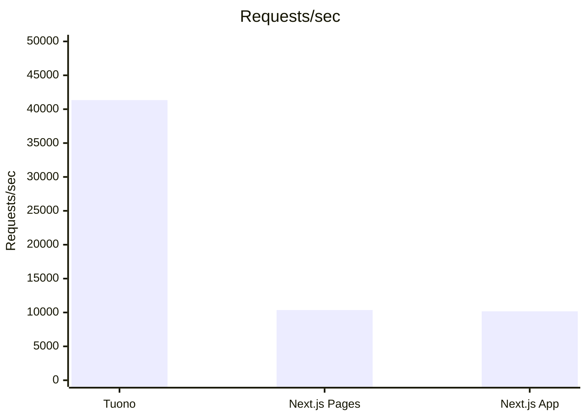
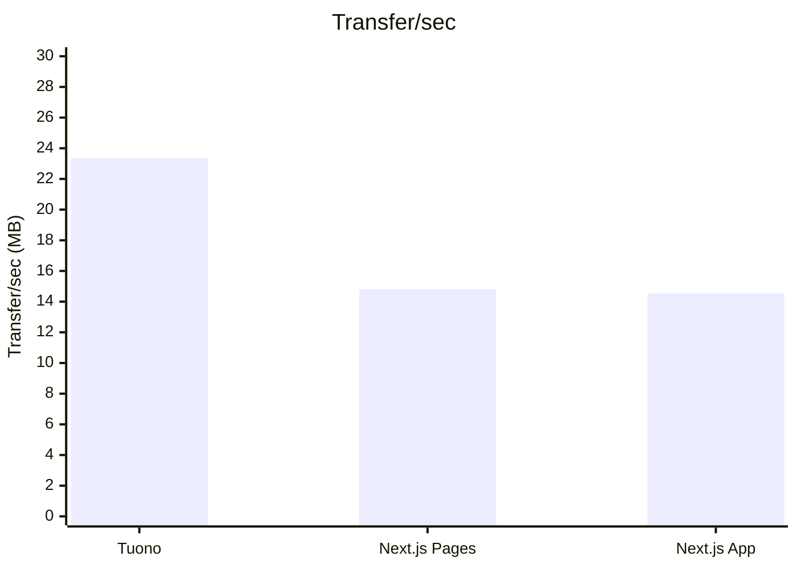

# Tuono benchmarks

This repository contains various setups to compare the HTTP performance of Tuono with other frameworks. Please refer to the [`benchmarks`](./benchmarks/) directory for more details.

The main goal is to make the comparison as fair as possible enhancing each framework specific
performance improvements.

Any improvement to the benchmarks or implementation of a different framework is strongly appreciated.

Feel free also to try it with your hardware and open an issue in case you spot significant different results.

## Benchmark setup

In order to make each comparison as fair as possible each framework should contain a single server side
rendered page that requires data from the backend service.

The data returned by the backend service should be a JSON including a random number between 0 and 10.

```json
{
  "data": 0
}
```

The benchmark is triggered by running the production server and querying the `/` endpoint with [wrk](https://github.com/wg/wrk) to simulate a heavy network load on the application.

## Last benchmarked version results

[v0.17.0](/benchmarks/v0.17.0)

### Tuono

```sh
tuono build
cargo run --release
```

```sh
wrk -t12 -c400 -d30s http://localhost:3000/
```

```text
Running 30s test @ http://localhost:3000/
  12 threads and 400 connections
  Thread Stats   Avg      Stdev     Max   +/- Stdev
    Latency    10.10ms    8.60ms 328.41ms   92.91%
    Req/Sec     3.47k   369.32     4.35k    92.02%
  1241083 requests in 30.02s, 700.90MB read
Requests/sec:  41341.09
Transfer/sec:     23.35MB
```

### NextJs pages router

```sh
pnpm build
pm2 start ./ecosystem.config.js
```

```sh
wrk -t12 -c400 -d30s http://localhost:3000/
```

```text
Running 30s test @ http://localhost:3000/
  12 threads and 400 connections
  Thread Stats   Avg      Stdev     Max   +/- Stdev
    Latency    40.86ms   36.33ms 964.36ms   97.35%
    Req/Sec     0.88k   141.64     2.36k    82.48%
  311635 requests in 30.08s, 445.20MB read
Requests/sec:  10358.80
Transfer/sec:     14.80MB
```

### NextJs app router

```sh
pnpm build
pm2 start ./ecosystem.config.js
```

```sh
wrk -t12 -c400 -d30s http://localhost:3000/
```

```text
Running 30s test @ http://localhost:3000/
  12 threads and 400 connections
  Thread Stats   Avg      Stdev     Max   +/- Stdev
    Latency    39.96ms   22.27ms 676.87ms   92.92%
    Req/Sec     0.86k   156.94     1.44k    80.99%
  306113 requests in 30.10s, 437.31MB read
Requests/sec:  10170.10
Transfer/sec:     14.53MB
```

## Graphs

<!--Made w/ Kimi K2 • Can be scripted in the future • Prompt: "Make a bar chart of the above Benchmarks for Requests and Transfers per sec in mermaid's xychart-beta. Sort from highest to lowest. Also put bulletpoints under each chart of what is the highest to lowest.")-->



- **Highest:** Tuono – 41,341 req/sec
- **Next:** Next.js Pages – 10,359 req/sec
- **Lowest:** Next.js App – 10,170 req/sec



- **Highest:** Tuono – 23.35 MB/sec
- **Next:** Next.js Pages – 14.80 MB/sec
- **Lowest:** Next.js App – 14.53 MB/sec
